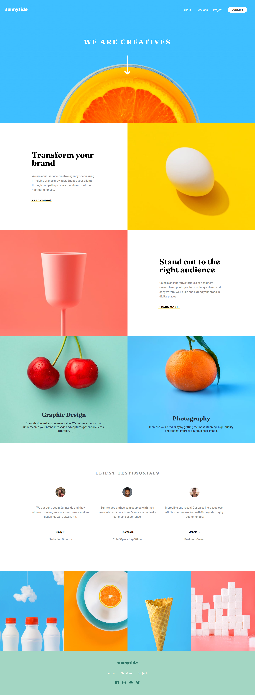
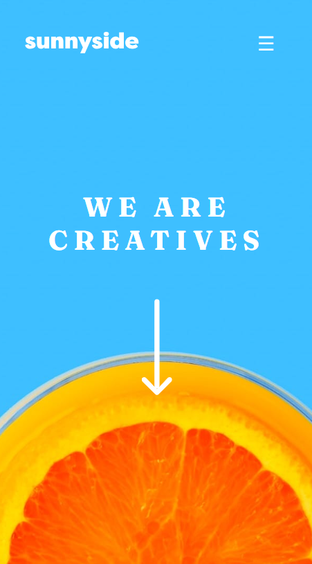

# Frontend Mentor - Sunnyside Agency Landing Page Solution

This is my solution to the [Sunnyside Agency Landing Page challenge](https://www.frontendmentor.io/challenges/sunnyside-agency-landing-page-7yVs3B6ef) on Frontend Mentor. This challenge helped me improve my frontend skills by working on a real-world design.

## Table of Contents

- [Overview](#overview)
  - [The Challenge](#the-challenge)
  - [Screenshots](#screenshots)
  - [Links](#links)
- [My Process](#my-process)
  - [Built With](#built-with)
  - [What I Learned](#what-i-learned)
  - [Future Improvements](#future-improvements)
- [Author](#author)
- [Acknowledgments](#acknowledgments)

## Overview

### The Challenge

Users should be able to:

- View the optimal layout of the site based on their screen size
- See hover effects on interactive elements
- Navigate smoothly between sections
- Access a responsive gallery and testimonials section

### Screenshots

#### Desktop View:



#### Mobile View:



## Links

- [Live Demo](https://your-live-site-url.com)
- [Solution on Frontend Mentor](https://your-solution-url.com)
- [Source Code on Github](https://github.com/UmanIjaz/sunnyside-agency)

## My Process

### Built With

- Semantic **HTML5**
- **CSS** custom properties
- **Flexbox** and **CSS Grid**
- **Desktop-first workflow**
- **React.js** for interactive UI
- **Styled Components** for modular styling

### What I Learned

During this project, I improved my ability to create responsive layouts and learned how to optimize images for different screen sizes. Here’s an example of a responsive component:

```js
const GalleryImage = ({ mobileSrc, desktopSrc, alt }) => {
  return (
    <picture>
      <source media="(min-width: 768px)" srcSet={desktopSrc} />
      
    </picture>
  );
};
```

### Future Improvements

- Enhance accessibility by improving keyboard navigation and screen reader support
- Implement **lazy loading** for images to optimize performance
- Add animations for a more engaging user experience

## Author

- **GitHub:** [Muhammad Uman Ijaz](https://github.com/UmanIjaz)
- **Frontend Mentor:** [@UmanIjaz](https://www.frontendmentor.io/profile/UmanIjaz)
- **LinkedIn:** [umanijaz](https://www.linkedin.com/in/umanijaz/)

## Acknowledgments

Thanks to the Frontend Mentor community for providing helpful feedback and inspiration!
